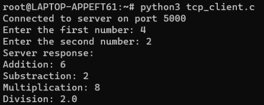

# Networking-Servers-
NetConnect is a revolutionary networking project that combines single-server client communication with multi-server scalability. This seamless integration optimizes performance, enhances security, and simplifies network management. It empowers organizations with a flexible and reliable network solution for a connected future.

## PART I - Single Process (Server)
- In the single-processor server-client connection, the server can only handle one client at a time.
  
- When a client connects to the server, the server accepts the connection and initiates a new thread to handle the client's request.
  
- While the server is serving the first client, it cannot accept new connections from other clients.
  
- If a second client attempts to connect while the first client is still being served, the connection request will be denied, and the second client will receive an error message.
  
- The server program processes client requests sequentially, one at a time.
  
- If a second client attempts to connect before the server is ready to accept new connections, it will receive an error message indicating that the server is busy, and the client should try again later.

# Single Process (Server)
To implement the single-process server-client network

- We'll need the IP address of the host, in order to successfully set a network between server and client.

To get the IP address of the host. Run -

```bash
  ip address show
```

Enter the host IP address and the post number.
```bash
  Enter Host IP Address: 172.31.27.135 
```
```bash
  Enter the Port Number: 5000
```
### Start the Server

```bash
  python server.py
```
The server will start listening for client connections.


### Start the Client

```bash
  python client.py
```
The client will prompt you to enter the math operation details (e.g., add/subtract/multiply/divide, operands).
After the Network is successfully connected, the client is able to do the basic calculation like Addition, Multiplication, Substraction and Division.



## PART II - Multi-Process (Server)
- In a multi-processor server-client architecture, the server can handle multiple client requests simultaneously.
  
- Each client connection is handled by a separate thread or process, enabling the server to process multiple requests concurrently.
  
- Unlike the single-processor setup, the multi-processor architecture allows the server to accept and handle new client requests while still serving existing clients.
  
- In the single-processor code, a second client attempting to connect while the first client is being served would be blocked, resulting in delays and a poor user experience.
  
- However, in the multi-processor setup, if a second client connects while the first client is being served, the server can accept and process the second client's request separately, avoiding delays.
  
- This architecture significantly improves the user experience by reducing waiting times and providing a more responsive service.
  
- The multi-processor server-client architecture eliminates errors caused by concurrent client connections, as each client is handled independently by dedicated threads or processes.

# Multi-Process (Server)
To implement a multi-server (single server handling multiple clients) network

- We'll need the IP address of the host, in order to successfully set a network between server and client

To get the IP address of the host. Run -

```bash
  ip address show
```

Enter the host IP address and the post number.
```bash
  Enter Host IP Address: 172.31.27.135 
```
```bash
  Enter the Port Number: 5000
```
### Start the Server

```bash
  python server.py
```
The server will start listening for client connections.
